# Project Name
> EDA - Landing Club case study

## Table of Contents
* [General Info](#general-information)
* [Technologies Used](#technologies-used)
* [Conclusions](#conclusions)
* [Acknowledgements](#acknowledgements)

<!-- You can include any other section that is pertinent to your problem -->

## General Information
- Provide general information about your project here.

    This company is the largest online loan marketplace, facilitating personal loans, business loans, and financing of medical procedures. Borrowers can easily access lower interest rate loans through a fast online interface. 
- What is the background of your project?

    Like most other lending companies, lending loans to ‘risky’ applicants is the largest source of financial loss (called credit loss). Credit loss is the amount of money lost by the lender when the borrower refuses to pay or runs away with the money owed. In other words, borrowers who default cause the largest amount of loss to the lenders. In this case, the customers labelled as 'charged-off' are the 'defaulters'.  

    If one is able to identify these risky loan applicants, then such loans can be reduced thereby cutting down the amount of credit loss. Identification of such applicants using EDA is the aim of this case study.
- What is the business probem that your project is trying to solve?

    Understanding the driving factors (or driver variables) behind loan default, i.e. the variables which are strong indicators of default.
## Problem Statement:

    Conduct a comprehensive analysis of a dataset containing consumer attributes and loan attributes. Our goal is to gain insights into the factors influencing loan default rates and to develop strategies to mitigate risks associated with lending.
- What is the dataset that is being used?

    The dataset contains information about past loan applicants and whether they ‘defaulted’ or not. The aim is to identify patterns which indicate if a person is likely to default, which may be used for taking actions such as denying the loan, reducing the amount of loan, lending (to risky applicants) at a higher interest rate, etc.

## Objective

- **Importing necessary Modules**:
Import the modules necessary for Data Manipulation and Visualization.

- **Reading dataset**:
Read the dataset containing loan applicant information.

- **Exploring the Dataset**:
Understand the Structure and various datatypes of the attributes within the dataset.

- **Missing value analysis**:
Identify and analyze missing values in the dataset.

- **Analysing categorical and numerical columns**:
Analyze categorical and numerical columns to understand the statistical properties and relationships within the dataset.

- **Univariate Analysis**:
Conduct univariate analysis to explore the distribution and characteristics of individual variables.

 -   **Outliers**:
Identify and analyze outliers within the dataset to understand their impact on the analysis.

- **Bivariate analysis**:
Conduct bivariate analysis to explore relationships between different variables and their impact on loan default rates.
<!-- You don't have to answer all the questions - just the ones relevant to your project. -->

## Conclusions
## Conclusion from the Categorical Univariate Analysis -1

-    Most of the loans comes under Grade and Subgrade A, B and C. 

-    Majority of loans had been issued in year 2011 and Jun-Dec months.

-    California and Newyork state has the highest no of loans issued.

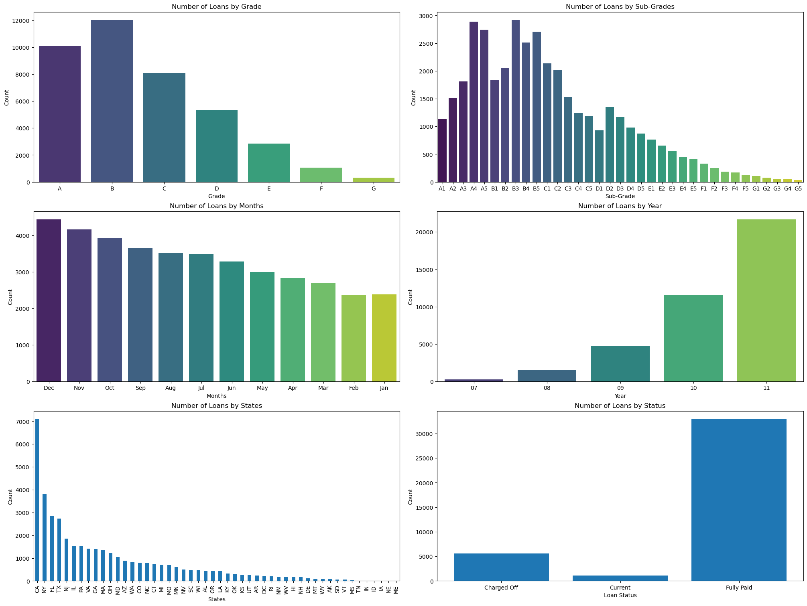

## Conclusion from the Univariate Numerical Analysis 2

-    **High Loan Amounts:** The right-skewed distribution of loan_amnt suggests that a significant proportion of loans are for larger amounts. Larger loans generally carry higher risk due to the potential for larger losses in case of default.

-    **High Interest Rates:** The right-skewed distribution of int_rate indicates that a portion of loans have significantly higher interest rates. These loans are often associated with higher risk borrowers and may have a higher likelihood of default.

-    **Income Distribution:** The right-skewed distribution of annual_inc suggests that a majority of borrowers have lower incomes. Borrowers with lower incomes may have limited capacity to repay loans, particularly if they have taken on larger amounts or have high interest rates.

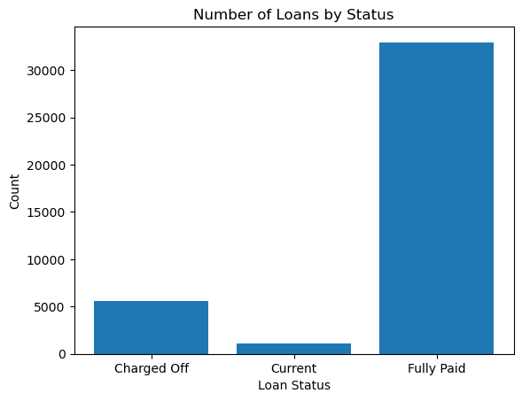

## Conclusion from Pie Plot (Loan Status, Grades and Purpose) Categorical Univariate Analysis 3
    This visualization can help us understand the proportion of loans that have been fully paid, charged off, or are currently in progress. 
    - We can see that the majority of loans have been fully paid.
    - Most of the loans are for debt consolidation

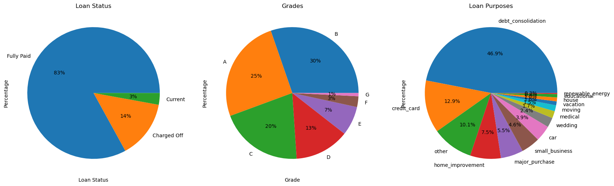

## Conclusion from Box Plot (Interest Rate by Grade,  Sub Grade and Loan Status) Byvariate Categorical Analysis 4 

 -   **High-Risk Grades (E, F, G):**

    High median interest rates, reflecting the high likelihood of default.

    Wider IQR and more outliers, signaling a significant variability in risk levels.

    These grades represent borrowers with poor credit histories or unstable incomes.

    Lenders face a high risk of non-payment, which is offset by charging much higher interest rates.

    Current and default loan staus have highr interest rates than fully paid.

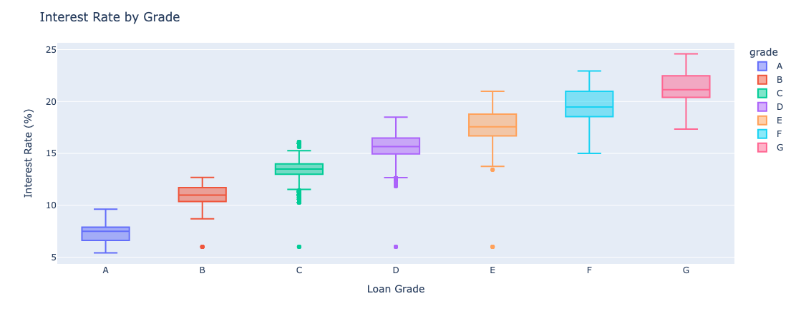
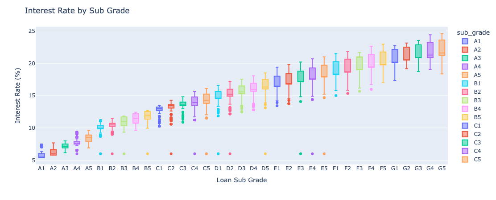
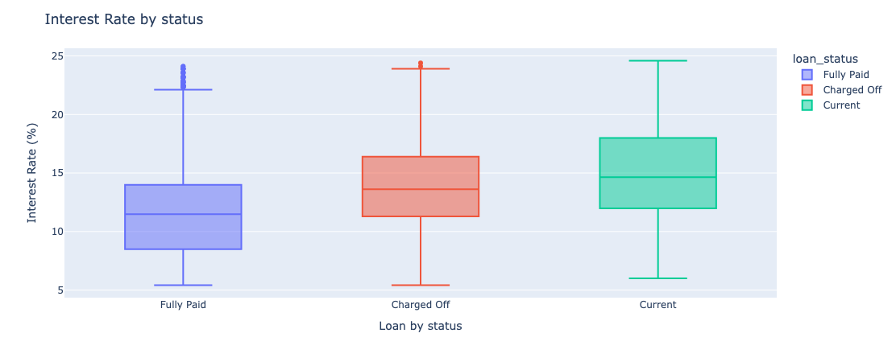
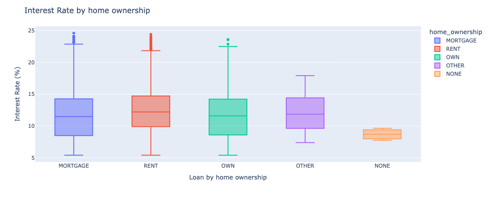
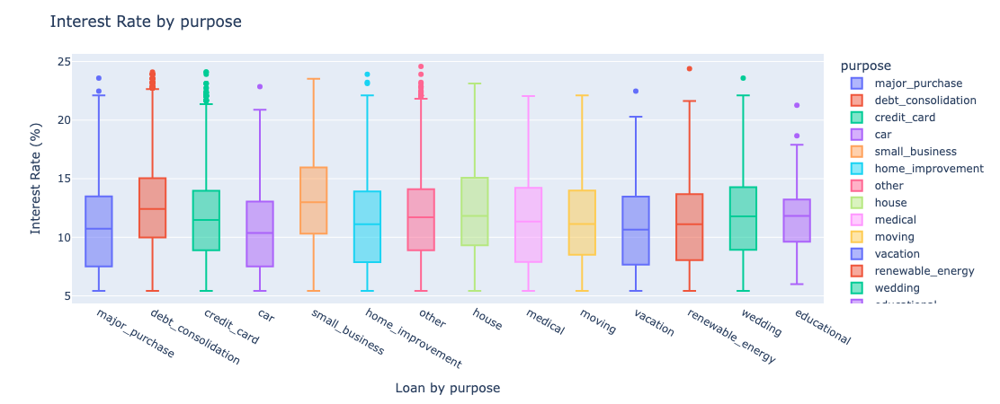

## Conclusion from Scatter Plot Numerical Byvariate Analysis 5

 -   **Weak Correlation:**

    The plot suggests no strong relationship between annual income and loan amount. Borrowers with similar incomes might request vastly different loan amounts.

    By analyzing these metrics together, you can assess the likelihood of a loan becoming risky or defaulting.  High late fees, outstanding principal, and low recoveries, it signals a larger risk to lenders and investors.

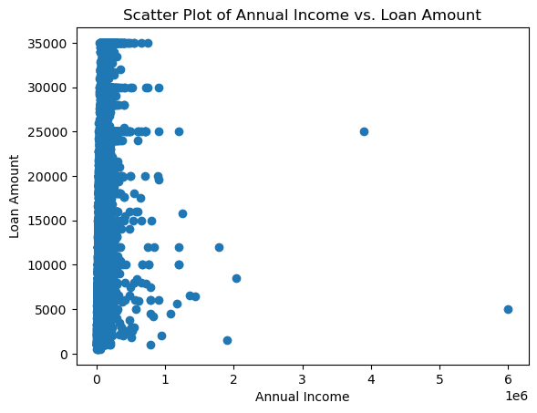

## Conclusion from Univariate and Byvariate Analysis 6 (Risky Loans) 

 -   **Loan Grades & Sub-Grades:** The distribution shows a concentration of risky loans in the lower grades (E, F, G) and their corresponding sub-grades. This aligns with expectations as lower grades typically represent higher risk.

 -   **Loan Status:** A significant portion of risky loans are either "Charged Off" (defaulted) or still "Current" (ongoing). This highlights the ongoing risk associated with these loans.

 -   **Interest Rates:** Risky loans consistently have higher interest rates compared to non-risky loans, indicating the lender's assessment of increased risk.
    Loan Purposes: Debt consolidation and credit card loans appear to be the most common purposes for risky loans. This suggests that borrowers struggling with existing debt may be more likely to take on higher-risk loans.

 -   **State Distribution:** The distribution of risky loans across states is not uniform. Some states have a higher concentration of risky loans compared to others, potentially indicating regional differences in risk factors.

    We can see that the majority of loans are for credit card debt consolidation, followed by other purposes such as home improvement and small business loans.

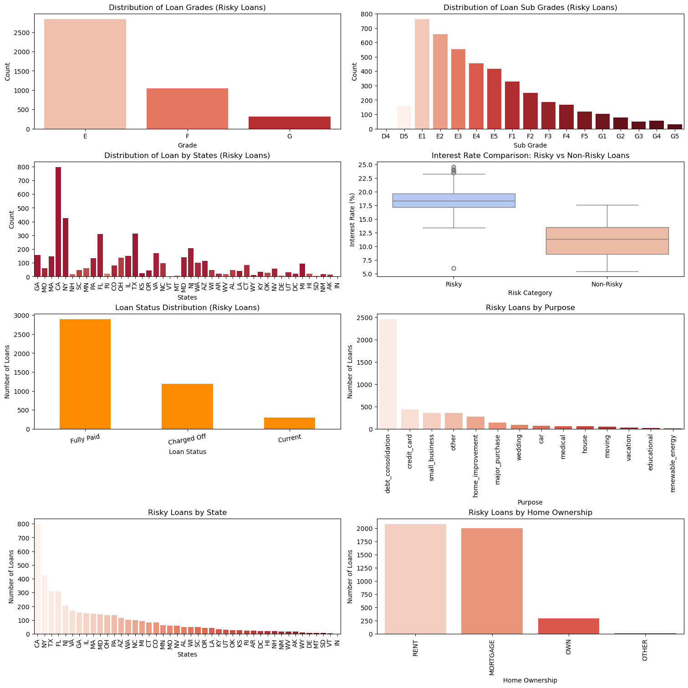

  ### Correlation Heat Map (Numerical Features) Bivariate Analysis

 -  **Negative correlation between DTI and annual income (-0.11):** 

    As income increases, the DTI ratio tends to decrease. A high DTI is a strong indicator of higher risk because it implies the borrower is already carrying a significant debt load relative to their income, which increases the likelihood of loan default.

    The weak positive correlation with loan amount (0.15) and revolving balance (0.26) also shows that higher loan amounts and higher balances tend to go hand-in-hand with a higher DTI, which is a risk factor for default.

-   **Correlation between loan_amnt and other variables:**

    The loan amount (loan_amnt) has a moderate positive correlation with the interest rate (int_rate) at 0.30 and a slightly higher positive correlation with annual income (annual_inc) at 0.41.
    It also has moderate positive correlations with revolving balance (revol_bal) and total accounts (total_acc).
    
 -   **Interest rate correlations:**

    The interest rate (int_rate) has a low positive correlation with loan amount (loan_amnt), but it has very low correlations with other variables like annual income (annual_inc) and revolving balance (revol_bal).

    The heatmap reveals that loan size, DTI, and revolving balance are strong indicators of risk. Larger loans, higher DTI ratios, and high revolving balances tend to increase the likelihood of default, while high income and low DTI ratios can mitigate this risk. Lenders should focus on these variables when assessing borrower risk to better predict the likelihood of loan repayment.

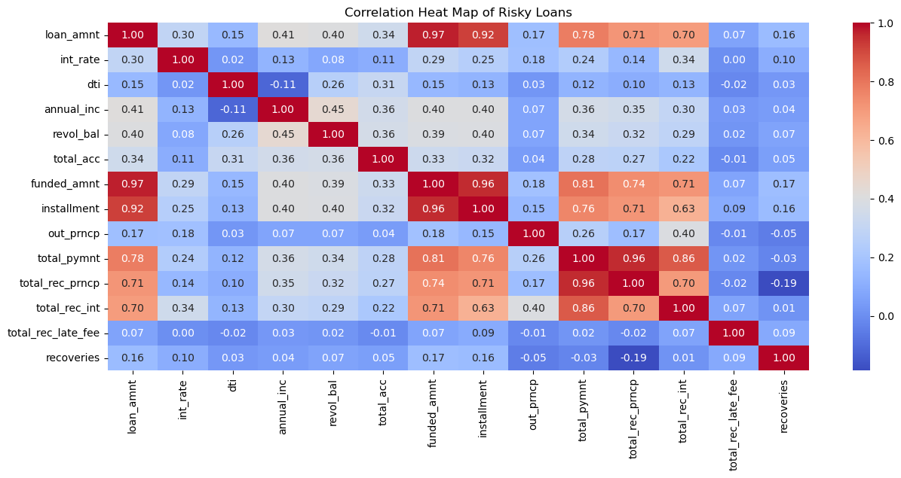

### Correlation Heat Map (Categorical Features) Analysis

-    Debt consolidation is strongly associated with higher-risk borrowers (grades D, E, F, G and sub-grades D4, D5). Borrowers in these groups are likely facing financial struggles, making them higher-risk for loan defaults.

-    Home improvement and small business loans, while somewhat common across sub-grades, show lower frequencies in riskier grades. These loan purposes may still indicate a level of financial planning or stability, but they are less prominent in the high-risk groups.

-    Credit card loans show a mixed frequency across grades and sub-grades. This could suggest that some borrowers in lower grades are using loans for credit-related needs, which can indicate over-reliance on credit, adding to the default risk.

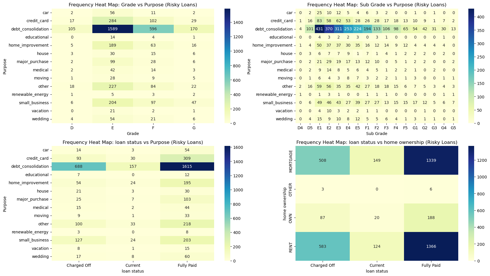

## Conclusion from the Revolving Utilization Heatmap Analysis 7
  
- **Sub Grade**

    Borrowers with sub-grades in the F and G categories represent high-risk groups due to their high revolving utilization. These borrowers are more likely to default or struggle with repayments.

    Borrowers with lower sub-grades (e.g., A and B) tend to use credit sparingly, making them safer for lenders.

    Higher sub-grade borrowers (E, F, G) exhibit risky behavior with higher utilization, potentially signaling over-leverage or poor financial management.

- **Grade**
    As the loan grade decreases (from A to G), the revolving utilization increases for each loan status category.

    There is variation within each grade and sub-grade, with some sub-grades showing significantly higher utilization rates, especially in the "Charged Off" and "Fully Paid" categories.

- **Loan Status Analysis:**

    Charged Off loans have significantly higher utilization compared to fully paid loans across all sub-grades, confirming that revolving utilization is a key risk indicator for defaults.

    Current loans are intermediate, showing higher utilization than fully paid loans but lower than charged off loans, reflecting their ongoing risk exposure.

    Lower sub-grades (A and B categories) demonstrate strong financial discipline, with consistently low utilization, even for charged-off loans.

    Borrowers in sub-grades G2, G3, and G4 are outliers with dangerously high utilization, particularly for charged-off and current loans.

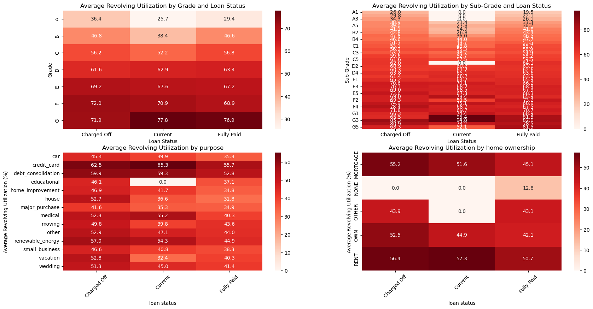

### Conclusion from the Box Plot (Loan Status vs Revolving Utilization) Analysis

- **Fully Paid Loans:**

    Median revolving utilization is lower compared to the other statuses.

    Indicates that borrowers who fully repay loans tend to have more conservative credit usage.

    The interquartile range (IQR) shows a narrower spread, suggesting more consistent credit behavior.

- **Charged Off Loans:**

    Median utilization is higher than Fully Paid loans, suggesting riskier credit behavior.

    The IQR is wider, indicating a higher variability in credit usage among borrowers whose loans are charged off.

    Borrowers in this group often have high utilization, hinting at financial stress or over-leverage.
    Current Loans:

- **Current Loans:**

    Median utilization is slightly below Charged Off loans but above Fully Paid loans.

    Reflects borrowers who are actively paying loans but may have higher revolving credit balances.

    IQR suggests a moderate spread, showing variability in usage but less than Charged Off loans.

## Conclusion from the Bar Plot (Loan Status by Employment Length, Verification Status etc) analysis 8

- **Employment Length and Loan Status:**
    
    The chart reveals that the majority of loans are held by individuals with employment lengths of 10+ years and 1 year. However, the proportion of "Charged Off" loans seems to be slightly higher for individuals with shorter employment lengths (< 1 year).

    The chart highlights how verification status varies across loan grades, reflecting different levels of borrower risk and lending practices:

    Grades A and B dominate in terms of the total number of loans issued. However, a significant portion of these loans is Not Verified, which could pose risks even for borrowers with strong profiles.

    Lower loan grades (E, F, G) exhibit a smaller volume of loans but show relatively higher proportions of Not Verified and Source Verified loans. This suggests a need for stricter verification processes to mitigate risk in these higher-risk categories.

    Mid-range Grades (C and D) act as a transition point, where there is a more balanced distribution of verified and non-verified loans.

- **Fully Paid Loans:**

    The majority of loans, across all verification statuses, are Fully Paid.
    Loans classified as Not Verified have the highest count of fully paid loans, suggesting that verification status alone may not be a determinant of repayment success.

- **Charged Off Loans:**

    Loans that are Not Verified have a slightly higher count of Charged Off loans compared to Source Verified and Verified loans.
    This indicates a potential risk associated with loans that lack proper verification.

- **Current Loans:**

    Loans currently in repayment or ongoing status are relatively fewer across all verification statuses.
    The proportion of Current Loans is consistent, suggesting that verification does not heavily influence ongoing repayments.

    While most loans are fully paid, there is a higher proportion of charged-off loans among Not Verified loans, indicating a risk for lenders.

    Strengthening verification measures might reduce defaults, even if not all loans are fully verified.
    
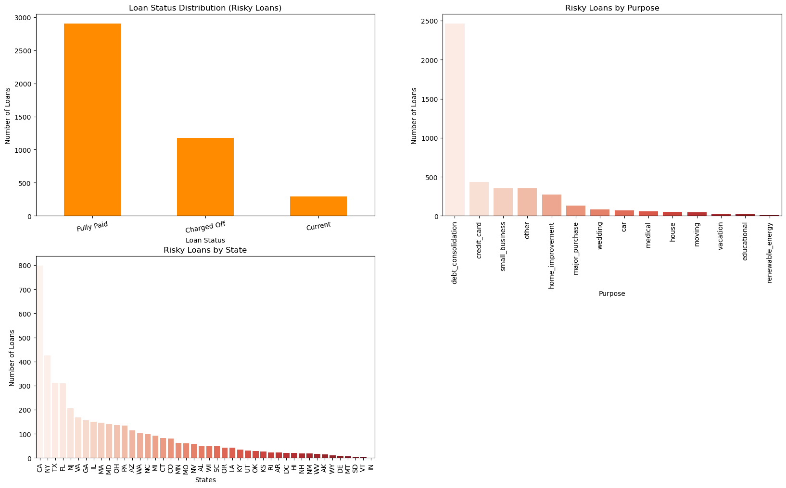
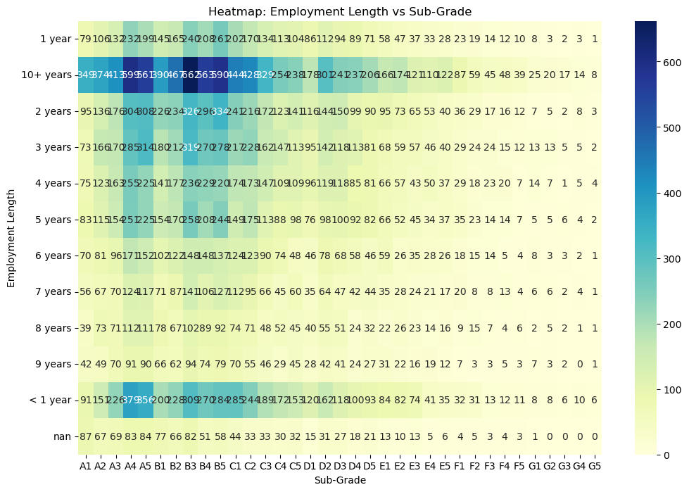
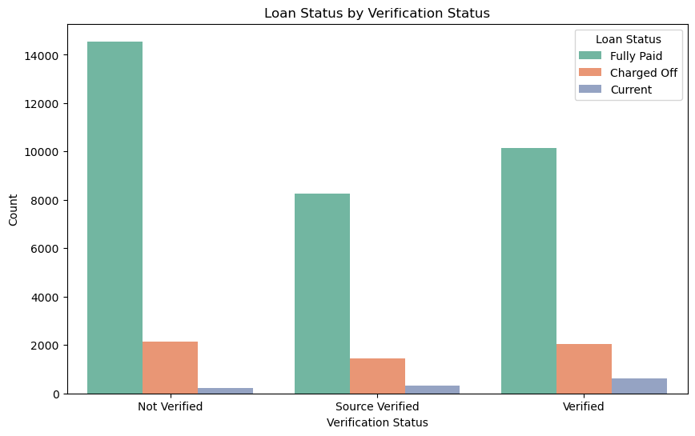
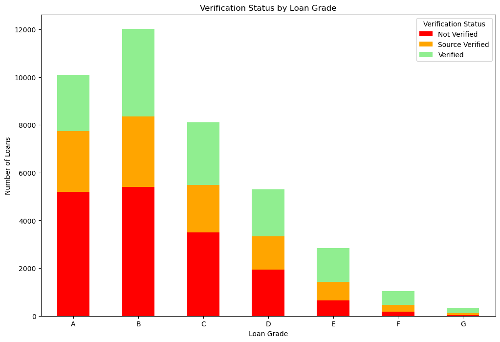

## Conclusion from Bar Plot (Loan Status by Home Ownership) Analysis 9

- **Home Ownership and Interest Rates:** 
    The box plot suggests a general trend that individuals with "NONE" or "OTHER" home ownership status tend to have lower interest rates compared to those who mortgage, rent, or own their homes.

- **Variability:** There's significant variability in interest rates across all home ownership categories. This indicates that other factors besides home ownership likely influence interest rates.

- **Outliers:** The presence of outliers suggests that some individuals within each category have interest rates that deviate significantly from the typical range.

- **Home Ownership:** The chart suggests that individuals who rent or own their homes might have lower credit risk compared to those with "OTHER" or "NONE" home ownership status. This is because renting or owning a home often indicates financial stability and responsibility.

- **Loan Status:** The presence of "Charged Off" loans across all home ownership categories indicates that credit risk exists regardless of home ownership status.

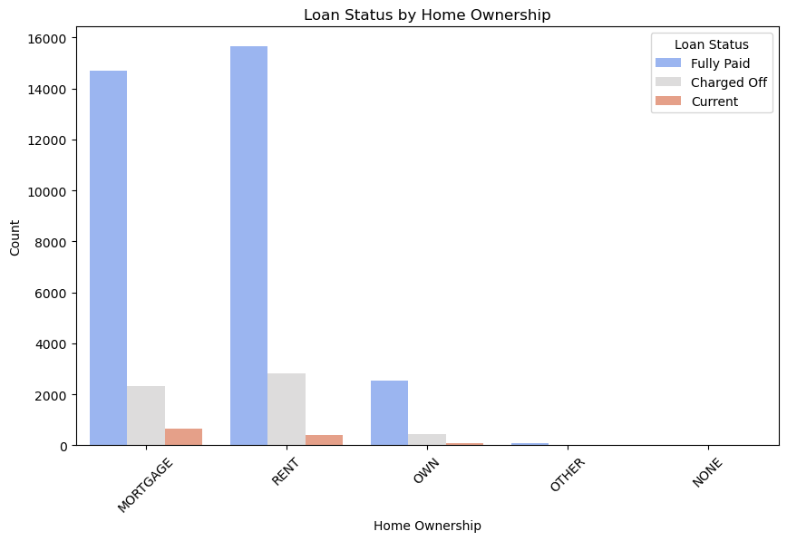
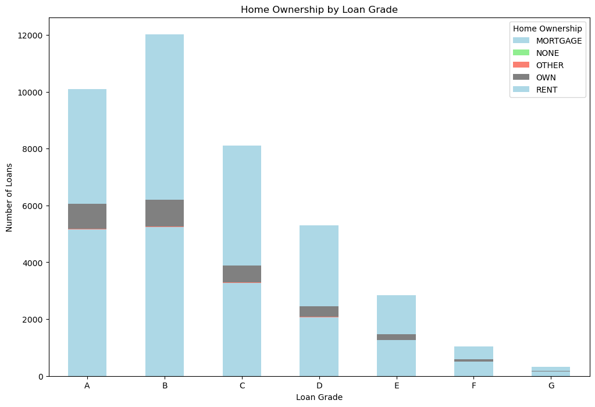
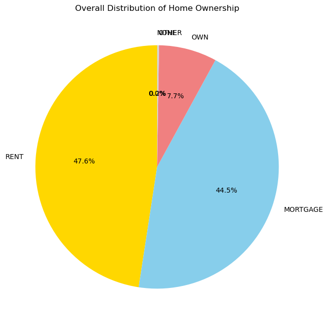
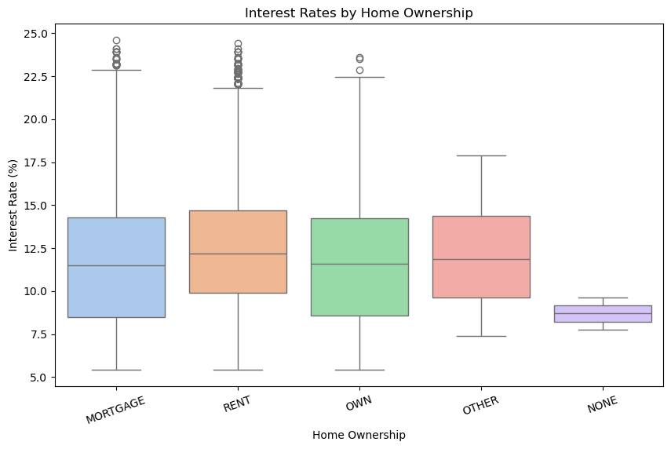

## Conclusion from the Bar Chart (Bankruptcies and Loan Status) Analysis  10

- **Bankruptcies and Loan Status:** The chart shows a clear trend: as the number of public record bankruptcies increases, the proportion of "Charged Off" loans also increases. This suggests that borrowers with a history of bankruptcies are more likely to default on their loans.

 - **Loan Distribution:** The vast majority of loans are held by individuals with no public record bankruptcies. The number of loans decreases significantly as the number of bankruptcies increases.

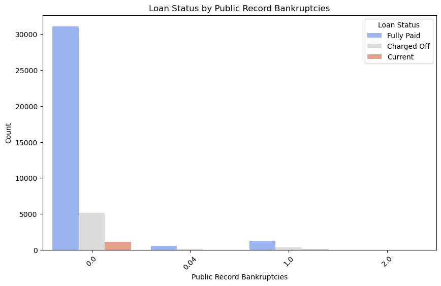

## Conclusion from the box plot Recovery Rate Analysis 11

 - **Low Recovery Rates:** The box plot indicates that recoveries for "Charged Off" loans are generally low. This highlights the significant credit risk associated with these loans and the potential for substantial losses for the lender.

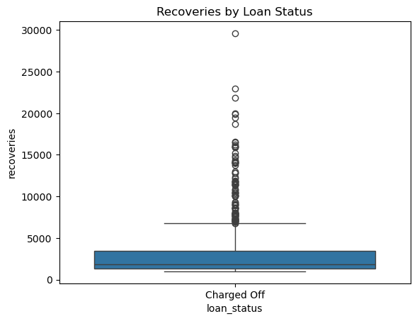

## Conclusion from the Scatter Plot Analysis 12

-    Loan repayment (total_pymnt) strongly depends on the funded amount.

-   Interest rates are relatively independent of borrowers’ annual income, suggesting risk assessment uses other factors.

 - **High Revolving Balance & Utilization:** A high revol_bal coupled with a high revol_util suggests that borrowers are heavily utilizing their available credit. This could indicate financial strain and a higher risk of default.

 - **Low Income:** Borrowers with low annual_inc might have limited capacity to repay loans, particularly if they have taken on large funded_amnt.
 - **Loan Size:** Large funded_amnt loans generally carry higher risk due to the potential for larger losses in case of default.

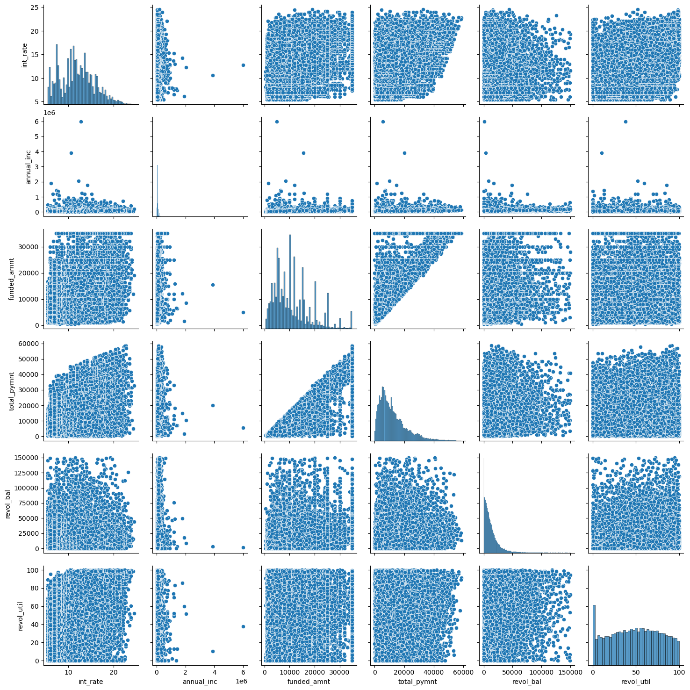

<!-- You don't have to answer all the questions - just the ones relevant to your project. -->

## Technologies Used
- python - version 3.12.4
- pandas - version 2.2.2
- matplotlib - version 3.8.4
- seaborn - version 0.13.2
- Plotly 5.22.0
- Jupyter Notebook
- Anaconda Navigator 2.6.3
- Visual Studio Code 1.96.0

<!-- As the libraries versions keep on changing, it is recommended to mention the version of library used in this project -->

## Acknowledgements
Give credit here.
- This project was inspired by...
- References if any...
- This project was based on [this tutorial](https://www.upgrad.com/).

## Contact
Created by [Niranjan Singh and Ameya Parab ] - feel free to contact me!

<!-- Optional -->
<!-- ## License -->
<!-- This project is open source and available under the [... License](). -->

<!-- You don't have to include all sections - just the one's relevant to your project -->