# Project Name
> EDA - Landing Club case study

## Table of Contents
* [General Info](#general-information)
* [Technologies Used](#technologies-used)
* [Conclusions](#conclusions)
* [Acknowledgements](#acknowledgements)

<!-- You can include any other section that is pertinent to your problem -->

## General Information
- Provide general information about your project here.
- What is the background of your project?
- What is the business probem that your project is trying to solve?
- ## Problem Statement:
> Conduct a comprehensive analysis of a dataset containing consumer attributes and loan attributes. Our goal is to gain insights into the factors influencing loan default rates and to develop strategies to mitigate risks associated with lending.
- What is the dataset that is being used?

<!-- You don't have to answer all the questions - just the ones relevant to your project. -->

## Conclusions
- Conclusion 1 from the analysis 1
This visualization can help us understand the distribution of loan amounts in the dataset. We can see that most loans fall in the range of $5,000 to $15,000

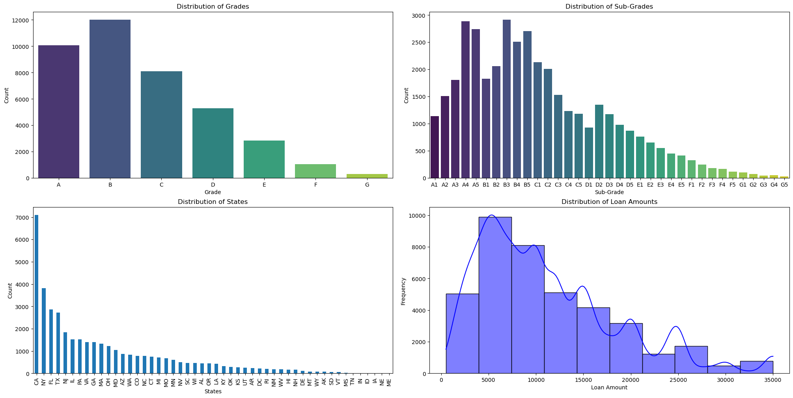
- Conclusion 2 from the analysis 1
This visualization can help us understand the distribution of loans in the dataset. We can see that most loans issued in year 20011

- Conclusion from the analysis 2

- Conclusion from the analysis 3

- Conclusion from the analysis 4

- Conclusion from the analysis 5

- Conclusion from the analysis 6

- Conclusion from the analysis 7

- Conclusion from the analysis 8

- Conclusion from the analysis 9

> **Debt-to-Income Ratio (DTI) and Risk:**

> Negative correlation between DTI and annual income (-0.11): 

> As income increases, the DTI ratio tends to decrease. A high DTI is a strong indicator of higher risk because it implies the borrower is already carrying a significant debt load relative to their income, which increases the likelihood of loan default.

> The weak positive correlation with loan amount (0.15) and revolving balance (0.26) also shows that higher loan amounts and higher balances tend to go hand-in-hand with a higher DTI, which is a risk factor for default.

> **Correlation between loan_amnt and other variables:**

> The loan amount (loan_amnt) has a moderate positive correlation with the interest rate (int_rate) at 0.30 and a slightly higher positive correlation with annual income (annual_inc) at 0.41.
> It also has moderate positive correlations with revolving balance (revol_bal) and total accounts (total_acc).
Interest rate correlations:

> The interest rate (int_rate) has a low positive correlation with loan amount (loan_amnt), but it has very low correlations with other variables like annual income (annual_inc) and revolving balance (revol_bal).

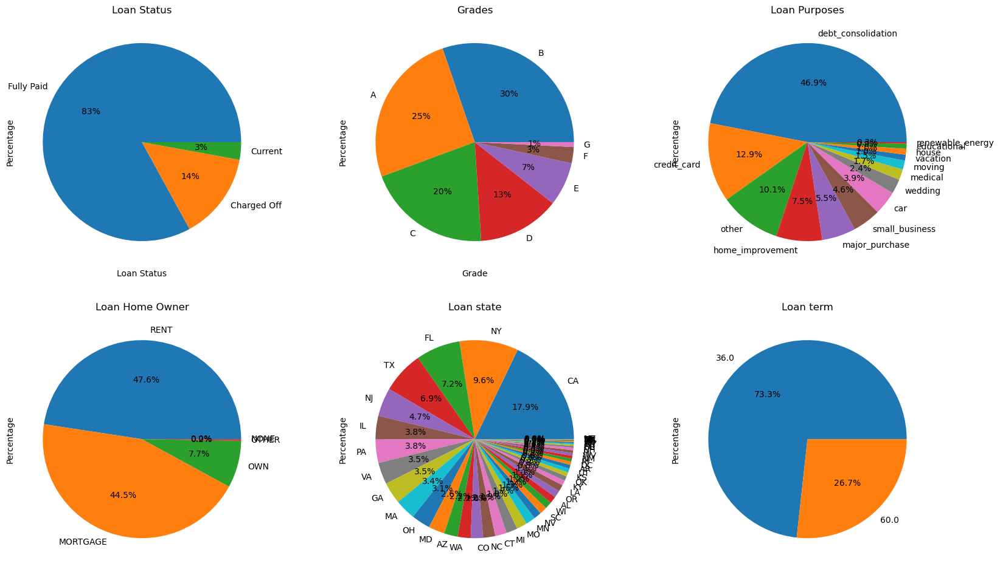
- Conclusion from the analysis 10
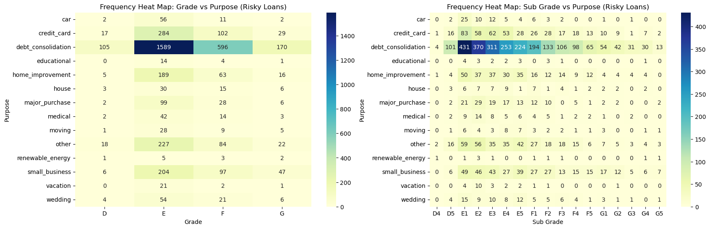
- Conclusion from the analysis 11
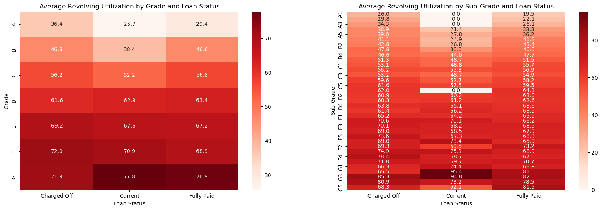
- Conclusion from the analysis 12

- Conclusion from the analysis 13
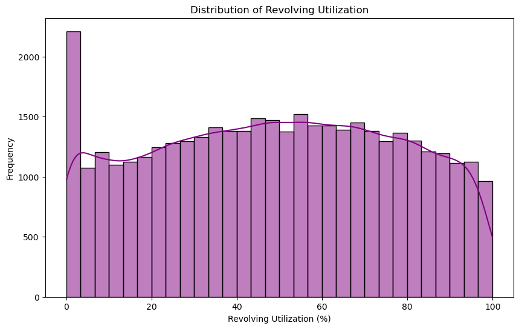
- Conclusion from the analysis 14
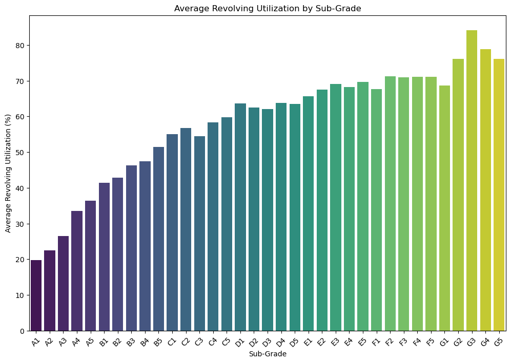
- Conclusion from the analysis 15
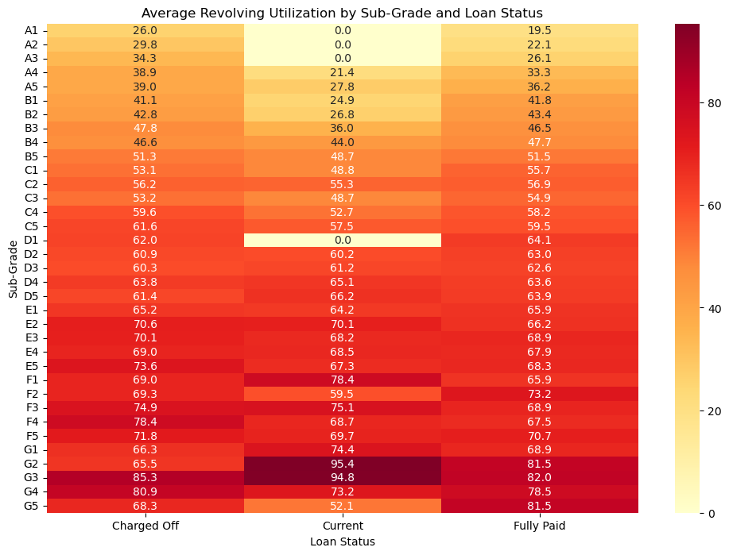
- Conclusion from the analysis 16
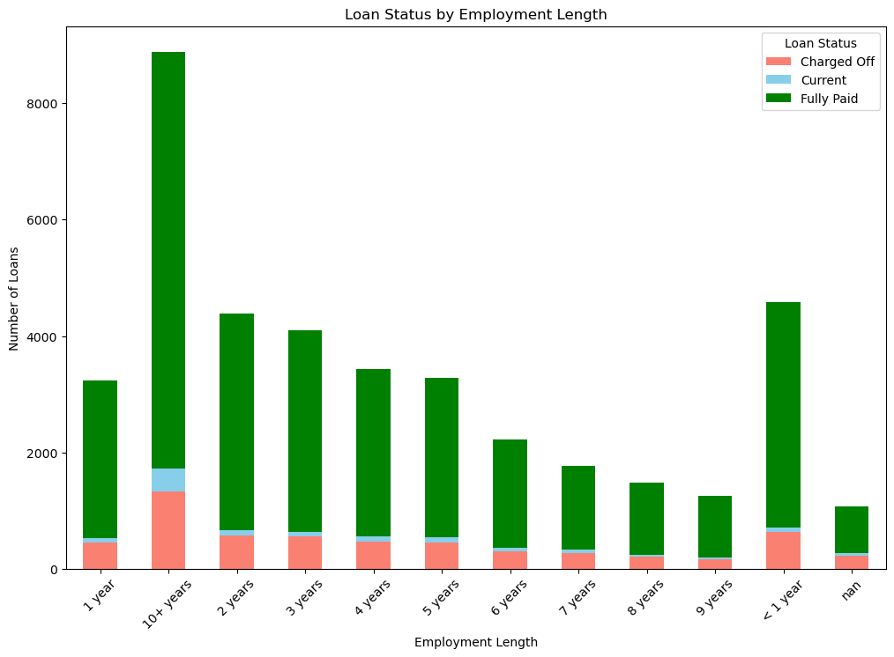
- Conclusion from the analysis 15
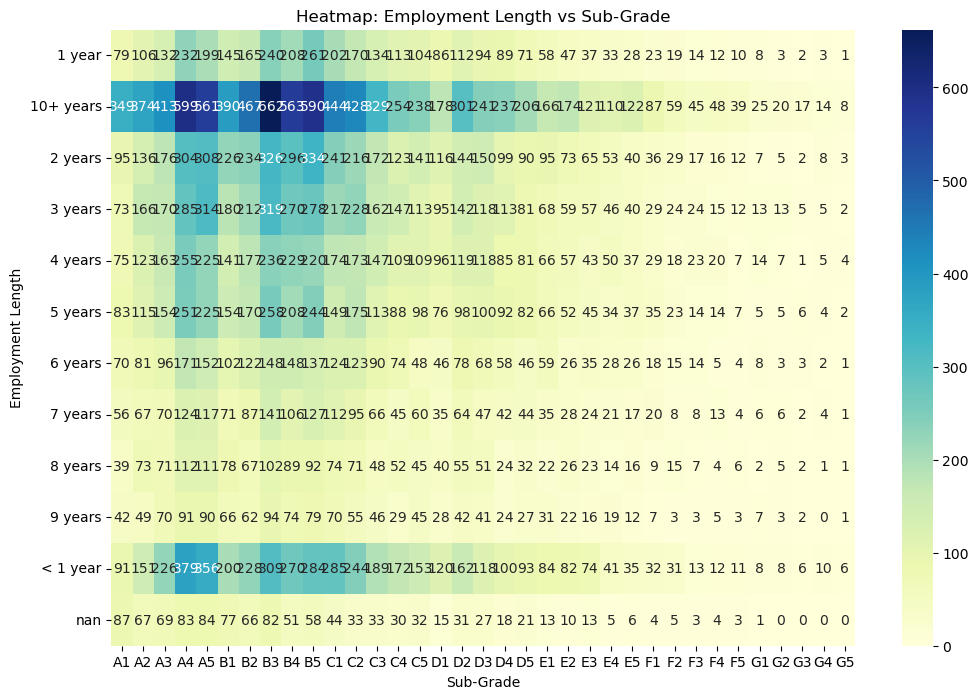
- Conclusion from the analysis 15
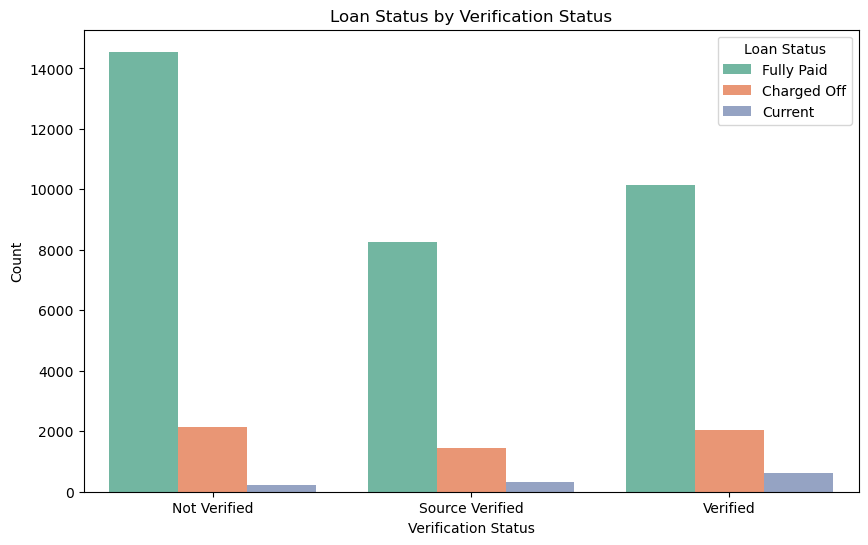
- Conclusion from the analysis 15
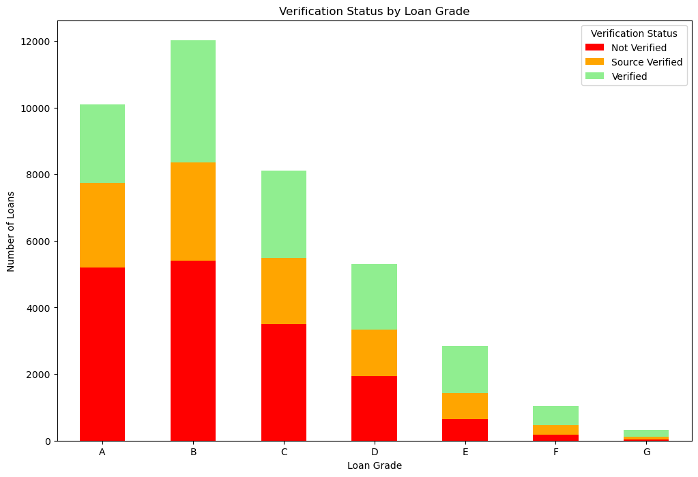
- Conclusion from the analysis 20
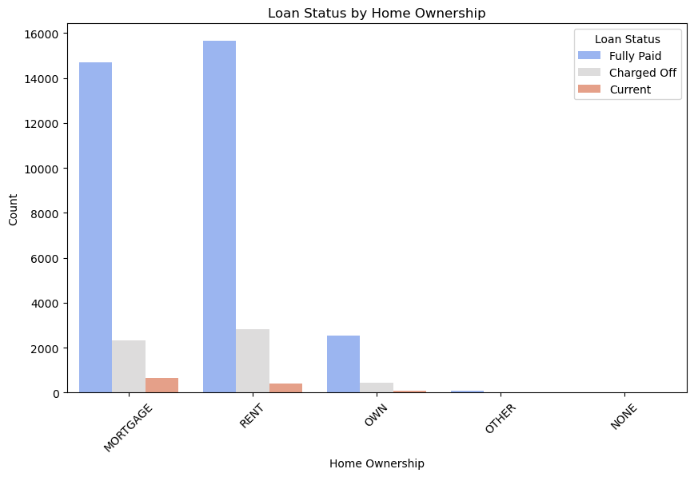
- Conclusion from the analysis 21

<!-- You don't have to answer all the questions - just the ones relevant to your project. -->

## Technologies Used
- python - version 3.12.4
- pandas - version 2.2.2
- matplotlib - version 3.8.4
- seaborn - version 0.13.2
- Plotly 5.22.0
- Jupyter Notebook
- Anaconda Navigator 2.6.3
- Visual Studio Code 1.96.0

<!-- As the libraries versions keep on changing, it is recommended to mention the version of library used in this project -->

## Acknowledgements
Give credit here.
- This project was inspired by...
- References if any...
- This project was based on [this tutorial](https://www.example.com).

## Contact
Created by [@githubusername] - feel free to contact me!

<!-- Optional -->
<!-- ## License -->
<!-- This project is open source and available under the [... License](). -->

<!-- You don't have to include all sections - just the one's relevant to your project -->